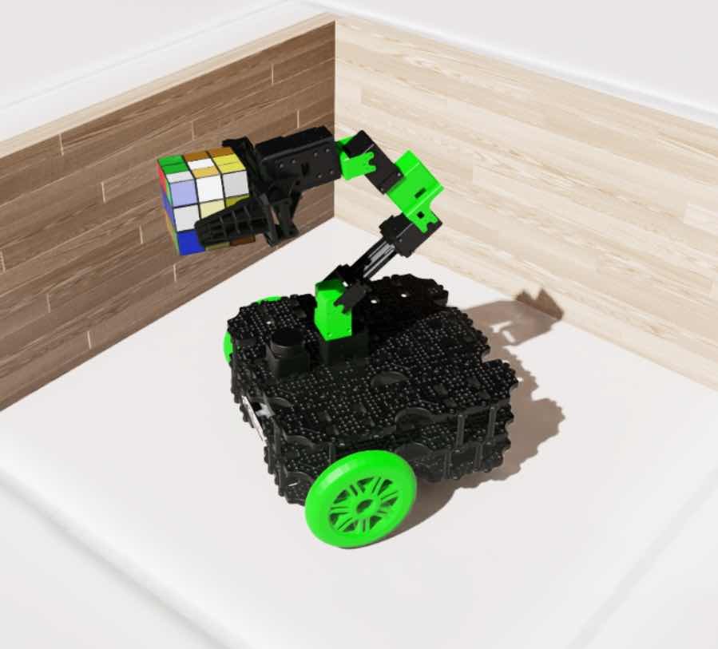

# Turtlebot3 Lime Experience with Isaac Sim and ROS 2 Humble

This repository contains configuration files and scripts for setting up an NVIDIA Isaac Sim 4.5.0 and ROS 2 Humble integration within a Docker container. This environment lets you build a system for running the Turtlebot3 Lime in Isaac Sim.




TurtleBot3 Lime is a ROS 2-based robot with a mobile base, a 6-DoF arm, and a Jetson Orin Nano, making it a single platform to explore all of Isaac Sim's features.

## Prerequisites
    
- An NVIDIA GPU with the latest drivers installed
- Docker with the NVIDIA Container Toolkit installed
- At least 30 GB of free disk space
- Ubuntu 22.04 

## Installation

### 1. Clone and Initialize the Repository

```bash
git clone https://github.com/momoiorg-repository/Turtlebot3_Lime_IsaacSim_Humble.git isaac_humble
cd isaac_humble
./init.sh
```

### 2. uild the Docker Image

```bash
docker build -t isaac_ws:latest .
```

This command builds a custom Docker image based on the official NVIDIA Isaac Sim 4.5.0 image, with ROS 2 Humble integration added.

## Usage


### Running Isaac Sim

1. Start the Docker container

```bash
./isaac_sim_docker.sh
```

This will launch the "isaac-sim-ws" Docker container and give you a shell prompt inside it.

2. Launch Isaac Sim
From within the container's shell session, start Isaac Sim using the following command

```bash
runheadless
```

3. Connect with the Omniverse Streaming Client
Once Isaac Sim is running in Docker, you can access it from another node using the Omniverse Streaming Client. To install the client on your client node, refer to the instructions here:

https://docs.isaacsim.omniverse.nvidia.com/4.5.0/installation/download.html

You will need to enter the server's IP address to connect.

4. Running TurtleBot3 Lime in Isaac Sim
To operate the TurtleBot3 Lime inside Isaac Sim, you'll need to load the Lime's USD model. You can download the USD file from this link

[Google Drive](https://drive.google.com/file/d/1zj03J05ni0jtlqXg845xG0uTzDkCmqzE/view?usp=sharing)

Install and place it inside **/isaac_humble/isaac_sim/documents**

## Project Structure

```
.
├── LICENSE - MIT License
├── README.md - This file
├── Dockerfile - Isaac Sim + ROS 2 Humble image
├── isaac_sim_docker.sh -Script to run the Isaac Sim container
├── init.sh - Script to initialize the directory structure
```

## Notes

- The Docker image is based on the official NVIDIA Isaac Sim 4.5.0 image with ROS 2 Humble added.
- The container uses the host's X11 server to display the GUI.
- Data persistence is managed via volume mounts to the host's filesystem.
- RViz2 and common ROS 2 tools are installed in the container.

## License

This project is provided under the MIT License. See the license file for more details.
